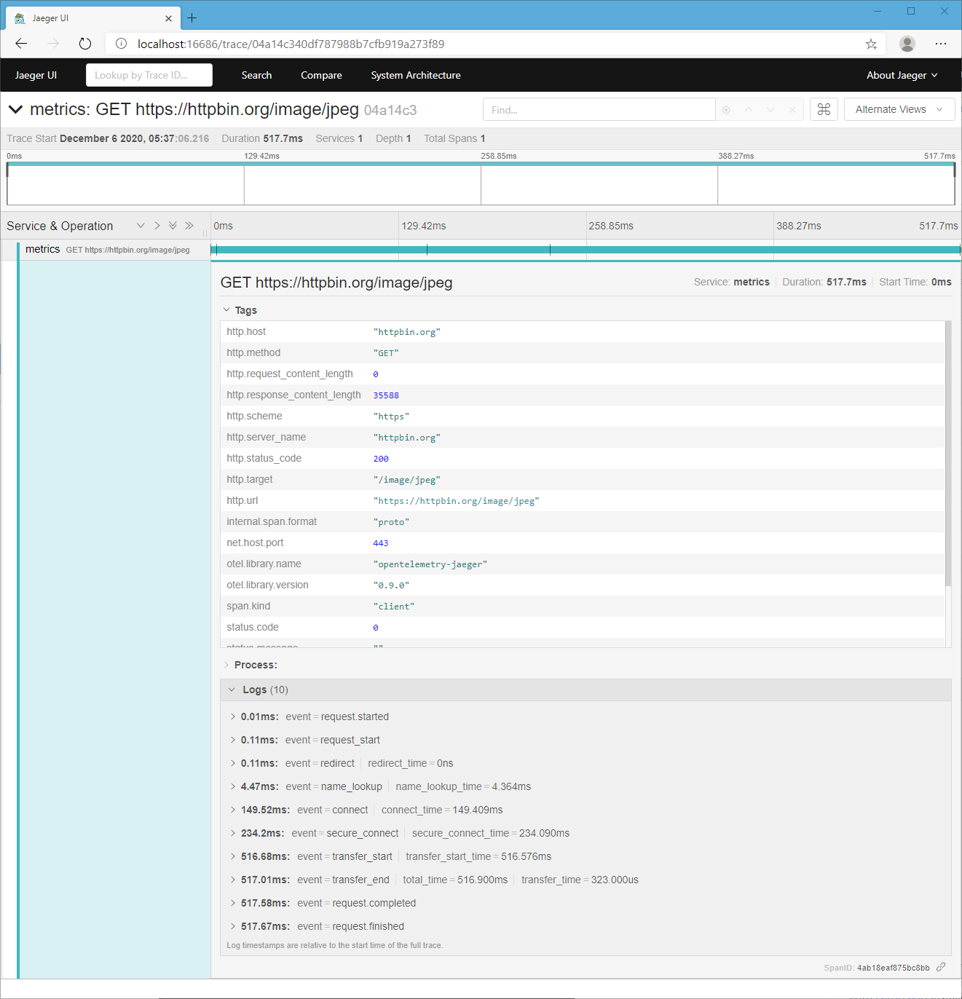

<h1 align="center">opentelemetry-surf</h1>
<div align="center"><strong>

[OpenTelemetry][otel] integration for [Surf][surf]

</strong></div><br />

<div align="center">
  <!-- Crates version -->
  <a href="https://crates.io/crates/opentelemetry-surf">
    
  </a>
  <!-- docs.rs -->
  <a href="https://docs.rs/opentelemetry-surf">
    
    <!--  -->
  </a>
  <!-- CI -->
  <a href="https://crates.io/crates/opentelemetry-surf">
    
  </a>
  <!-- Downloads -->
  <a href="https://crates.io/crates/opentelemetry-surf">
    
  </a>
</div>


## Notes

* It is heavily inspired by [opentelemetry-tide][otel-tide] crate; surf and tide share very similar middleware structure. Thank you, dear [@http-rs][http-rs] folks! 🙇🏻‍♂️
* It only implements very basic request tracing on the middleware layer.
  If something is missing, create a PR or open an issue and describe your desired feature.
* (soon) It records http request/response life cycle events when used with isahc and its metrics enabled. _(needs a change in http-client crate)_
* You probably do not want to use it in production. 🤷

## How to use

```shell
# Run jaeger in background
docker run -d -p6831:6831/udp -p6832:6832/udp -p16686:16686 jaegertracing/all-in-one:latest

# Run simple client example with tracing middleware
cargo run --example simple

# Run metrics client example (uses isahc with metrics enabled)
cargo run --example metrics --features isahc-metrics

# Open browser and view the traces
firefox http://localhost:16686/
```



## Code example

### `Cargo.toml`

```toml
async-std = { version = "1.7", features = ["attributes"] }
opentelemetry = { version = "0.10", features = ["async-std"] }
opentelemetry-jaeger = { version = "0.9", features = ["async-std"] }
# opentelemetry-surf = "0.1" # not yet released
opentelemetry-surf = { git = "https://github.com/asaaki/opentelemetry-surf" }
```

### `client.rs`

```rust
#[async_std::main]
async fn main() -> surf::Result<()> {
    let (tracer, _uninstall) = opentelemetry_jaeger::new_pipeline().install().unwrap();
    let otel_mw = opentelemetry_surf::OpenTelemetryTracingMiddleware::new(tracer);
    let client = surf::client().with(otel_mw);
    let res = client.get("https://httpbin.org/get").await?;
    dbg!(res);
    Ok(())
}
```

## Cargo Features:

## Safety
This crate uses ``#![forbid(unsafe_code)]`` to ensure everything is implemented in
100% Safe Rust.

## License

<sup>
Licensed under either of <a href="LICENSE-APACHE">Apache License, Version
2.0</a> or <a href="LICENSE-MIT">MIT license</a> at your option.
</sup>

<br/>

<sub>
Unless you explicitly state otherwise, any contribution intentionally submitted
for inclusion in this crate by you, as defined in the Apache-2.0 license, shall
be dual licensed as above, without any additional terms or conditions.
</sub>


<!-- links -->
[otel]: https://crates.io/crates/opentelemetry
[otel-tide]: https://crates.io/crates/opentelemetry-tide
[surf]: https://crates.io/crates/surf
[tide]: https://crates.io/crates/tide
[http-rs]: https://github.com/http-rs
